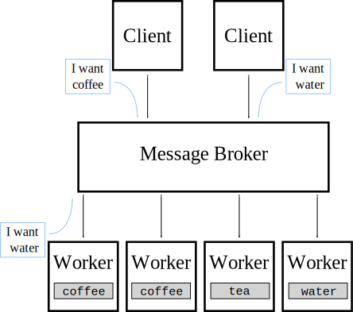

# DagBox Communication Protocol v1

[MDP]: <https://rfc.zeromq.org/spec:7/MDP/>

DagBox Communication Protocol (DCP) defines the protocol used by the
clients, workers and the broker to communicate. This document
describes the v1 version of the protocol.

It is largely inspired by the [Majordomo Protocol][MDP].

## License of the Document

Copyright 2017 Kaan Genç

 This work is licensed under a <a rel="license"
href="http://creativecommons.org/licenses/by-sa/4.0/">Creative Commons
Attribution-ShareAlike 4.0 International License</a>.

## Language

[RFC2119]: <https://tools.ietf.org/html/rfc2119>

The key words "MUST", "MUST NOT", "REQUIRED", "SHALL", "SHALL NOT",
"SHOULD", "SHOULD NOT", "RECOMMENDED", "MAY", and "OPTIONAL" in this
document are to be interpreted as described in
[RFC 2119, Key words for use in RFCs to Indicate Requirement Levels][RFC2119].

## Goals

The DagBox Communication Protocol (DCP) is a reliable, service
oriented protocol which describes the communication between services,
clients and a broker. The goals of the protocol are:

* Allow requests to be routed to workers based on service names.
* Allow brokers to distribute work to multiple workers efficiently.
* Allow clients to perform multiple requests without waiting for
  replies.
* Allow peers to detect disconnects.

## Architecture

There are 3 kinds of components in DCP. These are clients, workers and
broker. There MAY be any number of clients and workers, and there MUST
be 1 and only 1 broker. Components SHALL communicate using ØMQ. The
broker acts as a persistent, central point of communication. Other
components can connect to the broker to gain access to the
system. When a component connects, it is considered to be a client. A
client MAY register itself as a service to become a worker.

Clients are able to send requests. Workers are able to both send
requests, and also accept requests and return replies. The broker is
tasked with maintaining a queue for each service. Requests SHOULD be
queued, and served to workers as they become available to accept work.

The broker and workers are NOT REQUIRED to persistantly hold
requests. Requests may be lost if one of these components
crashes. Clients SHOULD keep track of when they have sent the request
and retry if it exceeds a client-defined timeout.

## Message Format

DCP uses the ØMQ's multiple message part functionality to format
messages. All DCP messages start with the DCP header. The header is
composed of 4 message parts:

* Sender address: This part is automatically inserted by ØMQ for
  clients and workers when the message is first sent, and stripped
  when a reply is recieved. The broker MUST insert the address of the
  component that the message is being sent to in this part.
* Address delimiter: This is an empty part signifiying the end of the
  sender address.
* Protocol: This part contains 5 bytes, the characters `DGBX` followed
  by an unsigned 8-bit number describing the supported version of DCP.
* Message Type: This part contains only 1 byte, an unsigned 8-bit
  number describing the type of the message.
  
## Connection

The broker MUST always accept connections on a router type
(`ZMQ_ROUTER`) ØMQ socket. It MAY open 1 or more sockets. It MAY use
any transport that is supported by ØMQ.

Other components MUST connect to the broker using a dealer type
(`ZMQ_DEALER`) socket. Informing the components of the broker's
address is out of this protocol's scope; any solution may be used.

For clients, no message needs to be sent on a connection. Workers MUST
send a registration message to register the service they provide. The
registration message has the following format:

* DCP Header, with message type `0x01`.
* Service name, a string of any number of bytes. MAY contain any
  character.

If the registration is successful, the broker will confirm it by
responding with the same message.

## Requests & Replies

Both clients and workers MAY send requests. Requests MUST have the
following format:

* DCP Header, with message type `0x04`.
* Service name, a string of any number of bytes. MAY contain any
  character. The request SHALL be routed to a worker that provides
  this service.
* Client address. This part is optional for clients. The broker MUST
  insert the address of the client that sent the request here, if and
  only if this part was missing.
* Client address delimiter, an empty frame that shows the end of the
  client address.
* Metadata parts. Any number of non-empty parts MAY be inserted here
  by the client. The broker MUST NOT modify these parts when routing
  the message, and workers MUST copy these parts into the reply
  without any modifications.
* Metadata delimiter, an empty part that shows the end of the metadata
  parts.
* Data parts. Any number of parts may be inserted here by the
  client. The format of the parts depend on the service the message is
  being sent to.

Reply messages have a very similar format. There are only two
differences for the reply messages:

* The message type is `0x05`.
* The service name is not included.

Clients MAY send multiple requests without waiting for a reply. The
replies will not necessarily arrive in the same order as requests, the
client SHOULD use the metadata parts to track which reply corresponds
to which request.

If the broker or one of the workers crash, some request and reply
messages might be lost. Clients SHOULD keep copies of the requests
they have sent and retry them if they don't get a reply in a
reasonable amount of time.

The broker SHALL serve requests to the workers providing the matching
service. Once a worker has been given a request, the broker SHOULD NOT
give more requests to that worker until the it has responded to the
broker. Once given a request, a worker can do one of the following:

* Complete the request and respond with a reply
* Complete the work only partially, then respond with a request for
  another service to complete the rest
* Respond with a heartbeat to ask for more work

## Heartbeats

Clients MUST NOT send heartbeat messages to the broker.

Workers MUST periodically send heartbeat messages to the broker at an
implementation-defined interval, agreed upon with the broker. If the
worker has sent any other message to the broker in this interval, it
MAY skip a heartbeat message.

There are two kinds of heartbeat messages, ping and pong. Clients as
workers MUST sent ping messages. The broker MUST respond to every ping
message with a pong message.

The heartbeat messages are header-only, they MUST NOT contain any
parts other than the header. The ping messages have the type `0x02`
and pong messages have the type `0x03`.

If the broker receives a heartbeat message from a worker that is not
registered for any service, the broker MUST respond with a reconnect
message. A reconnect message is a header-only message with the type
`0x06. A worker that receives a reconnect message MUST send a
registration message to the broker.

## Security

DCP does not implement any authorization, authentication or encryption
mechanisms. Any security requirements should be fulfilled by layering
other solutions such as kernel namespaces and virtual private networks.

## Comparison to MDP

Compared to MDP, DCP has several advantages:

* Clients can send multiple requests without waiting for response,
  which makes it possible for a single client to utilize the resources
  of the system more efficiently.
* Workers can send heartbeats while they are busy processing a request
  to ask for more work. This allows workers which can process requests
  asynchronous to avoid waiting.
* Workers can send requests, allowing multiple workers to cooperate on
  a single request by passing it to other services. This allows
  complex requests to be split among multiple services.
